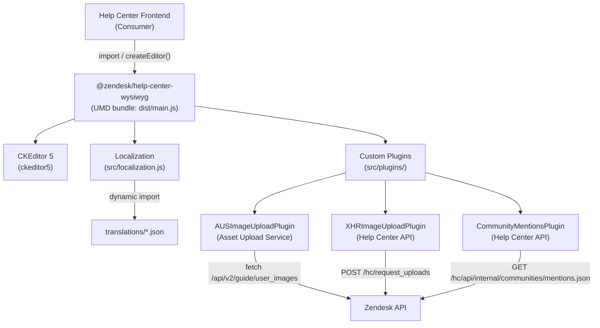

# Help Center WYSIWYG — Architecture

## System Overview

`@zendesk/help-center-wysiwyg` is a custom CKEditor 5 build packaged as a UMD library for Zendesk Help Center. It provides three distinct rich-text editor configurations — for Help Center comments, community posts, and support request forms — each with different plugin sets, image upload strategies, and UI behaviors. The library is consumed by Help Center frontends and published to npm; it is not a standalone application.

## Architecture Diagram

## Component Map

| Directory / File | Responsibility |
|-----------------|----------------|
| `src/index.js` | Editor class definition, `getEditorConfig()`, and `createEditor()` exports |
| `src/localization.js` | Bridges Zendesk i18n store with CKEditor's translation service |
| `src/styles.css` | Custom styles; must be imported last to override CKEditor defaults |
| `src/plugins/` | Custom CKEditor plugin implementations (see Plugin Inventory below) |
| `icon-overrides/` | Replaces CKEditor default icons with Zendesk Garden SVGs via webpack alias |
| `translations/` | Auto-generated locale JSON files (one per locale); do not edit directly |
| `translations.yml` | Source of truth for translation strings in the Zendesk localization system |
| `bin/translations.mjs` | Script to fetch generated translations from the Zendesk CDN |
| `webpack.config.js` | UMD bundle, CSS singleton injection, SVG loader, license key injection |
| `public/index.html` | Dev server example page for manual testing |

## Plugin Inventory

| Plugin | Editor Type(s) | Purpose |
|--------|---------------|---------|
| `AUSImageUploadPlugin` | comments, communityPosts | Uploads images via Zendesk Asset Upload Service (S3) |
| `XHRImageUploadPlugin` | supportRequests | Uploads images via XHR to `/hc/request_uploads` |
| `CommunityMentionsPlugin` | communityPosts (optional) | @-mention support querying `/hc/api/internal/communities/mentions.json` |
| `FormSubmissionPlugin` | all (built-in) | Manually submits form to ensure CSRF token is attached |
| `SyncTextareaPlugin` | supportRequests | Syncs editor HTML back to the original `<textarea>` and dispatches `input` event |
| `AriaAttributesPlugin` | supportRequests | Copies ARIA attributes from source `<textarea>` to editor for accessibility |
| `AttachInlineImagesPlugin` | supportRequests | Handles inline image attachment workflow |
| `HiddenFormFieldsPlugin` | comments | Injects hidden form fields (e.g. `content_type: text/html`) |
| `MarkExternalImagesPlugin` | communityPosts | Marks externally-hosted images |
| `ToolbarPlugin` | all (built-in) | Adds `tabindex="0"` to toolbar element for keyboard accessibility |
| `TestIdPlugin` | all (built-in) | Adds `data-test-id` attributes for E2E test targeting |

## Request Flow: Image Upload (AUS)

1. User drops or selects an image in the editor
2. `AUSImageUploadPlugin` intercepts via CKEditor's `FileRepository`
3. Fetches `/api/v2/users/me.json` to obtain a CSRF token (`authenticity_token`)
4. POSTs to `/api/v2/guide/user_images/uploads` to create an upload slot
5. PUTs the file directly to the pre-signed S3 URL from the upload slot
6. POSTs to `/api/v2/guide/user_images` to register the uploaded image
7. Returns the image URL to CKEditor for insertion into the document

## Key Design Decisions

### UMD Bundle
The library is bundled as UMD (`libraryTarget: "umd"`) so it can be consumed by diverse Help Center contexts — CommonJS, AMD, or browser globals — without requiring the consumer to configure a bundler.

### CSS as Singleton Style Tag
CSS is injected via `style-loader` with `injectType: "singletonStyleTag"` and `data-cke: true` to avoid duplicate `<style>` tags when the module is loaded in multiple contexts on the same page. `src/styles.css` must be imported last to take precedence.

### License Key via Build-Time Env Vars
The CKEditor 5 license key is injected at build time via `webpack.DefinePlugin` from environment variables (`CKEDITOR_LICENSE_KEY_PRODUCTION`, `CKEDITOR_LICENSE_KEY_DEVELOPMENT`). If neither is set, the GPL license is used in development. Keys must never be committed.

### Icon Overrides via Webpack Alias
CKEditor's icon package is aliased to `icon-overrides/src/index.js` in webpack config, replacing default icons with Zendesk Garden SVGs. The original package remains accessible as `@ckeditor/ckeditor5-icons-original`.

### Translation Bridge
CKEditor has its own translation system. `src/localization.js` dynamically imports the appropriate locale JSON at runtime and maps Zendesk i18n keys to CKEditor UI strings via `ckeditor5-utils/src/translation-service`.

## External Dependencies

| Service | Protocol | Used By | Purpose |
|---------|----------|---------|---------|
| `/api/v2/guide/user_images` | HTTPS fetch | AUSImageUploadPlugin | Register uploaded images |
| `/api/v2/guide/user_images/uploads` | HTTPS fetch | AUSImageUploadPlugin | Create S3 upload slot |
| `/api/v2/users/me.json` | HTTPS fetch | AUSImageUploadPlugin | Retrieve CSRF token |
| `/hc/request_uploads` | XHR POST | XHRImageUploadPlugin | Upload images for support requests |
| `/api/v2/help_center/sessions.json` | HTTPS fetch | XHRImageUploadPlugin | Retrieve CSRF token |
| `/hc/api/internal/communities/mentions.json` | HTTPS fetch | CommunityMentionsPlugin | @-mention user search |
| `static.zdassets.com` (Zendesk CDN) | HTTPS fetch | bin/translations.mjs | Fetch generated translation files |
